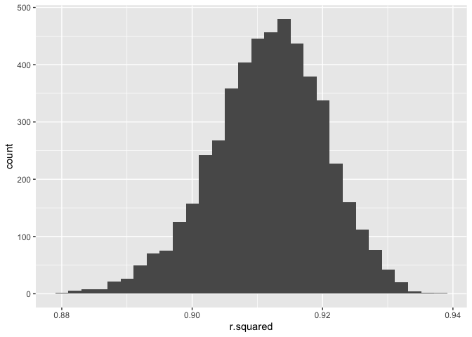
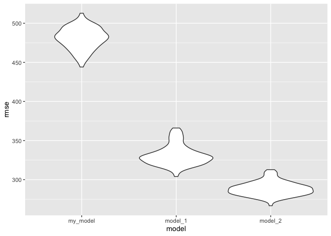
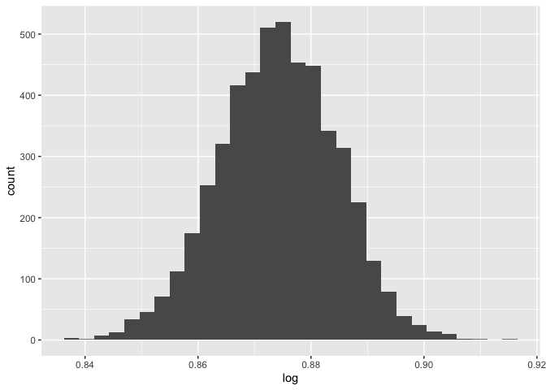

Data Science I Homework 6 - lzs2109
================
Louis Sharp
11/11/2021

``` r
library(tidyverse)
library(modelr)
```

### Problem 1

``` r
bweight_df = read_csv("./data/birthweight.csv")
```

    ## Rows: 4342 Columns: 20

    ## ── Column specification ────────────────────────────────────────────────────────
    ## Delimiter: ","
    ## dbl (20): babysex, bhead, blength, bwt, delwt, fincome, frace, gaweeks, malf...

    ## 
    ## ℹ Use `spec()` to retrieve the full column specification for this data.
    ## ℹ Specify the column types or set `show_col_types = FALSE` to quiet this message.

``` r
bweight_df = 
  bweight_df %>% 
  mutate(
    babysex = as.factor(babysex),
    frace = as.factor(frace),
    malform = as.factor(malform),
    mrace = as.factor(mrace))
```

``` r
#map(bweight_df, ~sum(is.na(.))) there appear to be no missing values

my_model = 
  lm(bwt ~ delwt + ppwt + ppbmi, data = bweight_df)

bweight_df %>% 
  add_residuals(my_model) %>% 
  add_predictions(my_model) %>%
  ggplot(aes(x = pred, y= resid)) + 
    geom_point() + 
    labs(x = "Fitted Values", y = "Residuals")
```

<!-- -->

``` r
lm(bwt ~ blength + gaweeks, data = bweight_df) %>% 
  broom::tidy()
```

    ## # A tibble: 3 × 5
    ##   term        estimate std.error statistic  p.value
    ##   <chr>          <dbl>     <dbl>     <dbl>    <dbl>
    ## 1 (Intercept)  -4348.      98.0      -44.4 0       
    ## 2 blength        129.       1.99      64.6 0       
    ## 3 gaweeks         27.0      1.72      15.7 2.36e-54

``` r
lm(bwt ~ bhead + 
         blength + 
         babysex + 
         bhead * blength + 
         blength * babysex + 
         bhead * babysex + 
         bhead * blength * babysex, 
         data = bweight_df) %>% 
broom::tidy()
```

    ## # A tibble: 8 × 5
    ##   term                    estimate std.error statistic      p.value
    ##   <chr>                      <dbl>     <dbl>     <dbl>        <dbl>
    ## 1 (Intercept)            -7177.     1265.       -5.67  0.0000000149
    ## 2 bhead                    182.       38.1       4.78  0.00000184  
    ## 3 blength                  102.       26.2       3.90  0.0000992   
    ## 4 babysex2                6375.     1678.        3.80  0.000147    
    ## 5 bhead:blength             -0.554     0.780    -0.710 0.478       
    ## 6 blength:babysex2        -124.       35.1      -3.52  0.000429    
    ## 7 bhead:babysex2          -198.       51.1      -3.88  0.000105    
    ## 8 bhead:blength:babysex2     3.88      1.06      3.67  0.000245

``` r
cv_df = 
  crossv_mc(bweight_df, 100) %>% 
  mutate(
    train = map(train, as_tibble),
    test = map(test, as_tibble))

cv_df = 
  cv_df %>% 
  mutate(
    my_model  = map(train, ~lm(bwt ~ delwt + ppwt + ppbmi, data = .x)),
    model_1   = map(train, ~lm(bwt ~ blength + gaweeks, data = .x)),
    model_2   = map(train, ~lm(bwt ~ bhead + 
                                     blength + 
                                     babysex + 
                                     bhead * blength + 
                                     blength * babysex + 
                                     bhead * babysex + 
                                     bhead * blength * babysex,
                               data = .x))) %>% 
  mutate(
    rmse_my_model = map2_dbl(my_model, test, ~rmse(model = .x, data = .y)),
    rmse_model_1  = map2_dbl(model_1, test, ~rmse(model = .x, data = .y)),
    rmse_model_2  = map2_dbl(model_2, test, ~rmse(model = .x, data = .y)))

cv_df %>% 
  select(starts_with("rmse")) %>% 
  pivot_longer(
    everything(),
    names_to = "model", 
    values_to = "rmse",
    names_prefix = "rmse_") %>% 
  mutate(model = fct_inorder(model)) %>% 
  ggplot(aes(x = model, y = rmse)) + geom_violin()
```

<!-- -->

``` r
cv_df %>% head()
```

    ## # A tibble: 6 × 9
    ##   train                 test  .id   my_model model_1 model_2 rmse_my_model rmse_model_1
    ##   <list>                <lis> <chr> <list>   <list>  <list>          <dbl>        <dbl>
    ## 1 <tibble [3,473 × 20]> <tib… 001   <lm>     <lm>    <lm>             483.         334.
    ## 2 <tibble [3,473 × 20]> <tib… 002   <lm>     <lm>    <lm>             487.         353.
    ## 3 <tibble [3,473 × 20]> <tib… 003   <lm>     <lm>    <lm>             493.         343.
    ## 4 <tibble [3,473 × 20]> <tib… 004   <lm>     <lm>    <lm>             461.         309.
    ## 5 <tibble [3,473 × 20]> <tib… 005   <lm>     <lm>    <lm>             471.         326.
    ## 6 <tibble [3,473 × 20]> <tib… 006   <lm>     <lm>    <lm>             490.         353.
    ## # … with 1 more variable: rmse_model_2 <dbl>

### Problem 2

``` r
weather_df = 
  rnoaa::meteo_pull_monitors(
    c("USW00094728"),
    var = c("PRCP", "TMIN", "TMAX"), 
    date_min = "2017-01-01",
    date_max = "2017-12-31") %>%
  mutate(
    name = recode(id, USW00094728 = "CentralPark_NY"),
    tmin = tmin / 10,
    tmax = tmax / 10) %>%
  select(name, id, everything())
```

    ## Registered S3 method overwritten by 'hoardr':
    ##   method           from
    ##   print.cache_info httr

    ## using cached file: ~/Library/Caches/R/noaa_ghcnd/USW00094728.dly

    ## date created (size, mb): 2021-11-28 11:33:19 (7.614)

    ## file min/max dates: 1869-01-01 / 2021-11-30

``` r
weather_bootstraps = 
  weather_df %>% 
  bootstrap(n = 5000) %>% 
  mutate(
    models = map(strap, ~lm(tmax ~ tmin, data = .x)),
    results_brglance = map(models, broom::glance),
    results_brtidy = map(models, broom::tidy)) %>% 
  select(.id, results_brglance, results_brtidy)

weather_bootstraps %>% 
  unnest(results_brglance) %>% 
  ggplot(aes(x = r.squared)) +
  geom_histogram()
```

    ## `stat_bin()` using `bins = 30`. Pick better value with `binwidth`.

<!-- -->

``` r
weather_bootstraps %>% 
  unnest(results_brtidy) %>% 
  select(.id, term, estimate) %>% 
  pivot_wider(names_from = term, values_from = estimate) %>% 
  janitor::clean_names() %>% 
  mutate(log = log10(intercept * tmin)) %>% 
  ggplot(aes(x = log)) +
  geom_histogram()
```

    ## `stat_bin()` using `bins = 30`. Pick better value with `binwidth`.

<!-- -->

``` r
weather_bootstraps %>% 
  unnest(results_brglance) %>% 
  summarize(ci_lower = quantile(r.squared, 0.025), 
            ci_upper = quantile(r.squared, 0.975))
```

    ## # A tibble: 1 × 2
    ##   ci_lower ci_upper
    ##      <dbl>    <dbl>
    ## 1    0.895    0.927

``` r
weather_bootstraps %>% 
  unnest(results_brtidy) %>% 
  select(.id, term, estimate) %>% 
  pivot_wider(names_from = term, values_from = estimate) %>% 
  janitor::clean_names() %>% 
  mutate(log = log10(intercept * tmin)) %>% 
  summarize(ci_lower = quantile(log, 0.025), 
            ci_upper = quantile(log, 0.975))
```

    ## # A tibble: 1 × 2
    ##   ci_lower ci_upper
    ##      <dbl>    <dbl>
    ## 1    0.853    0.894
